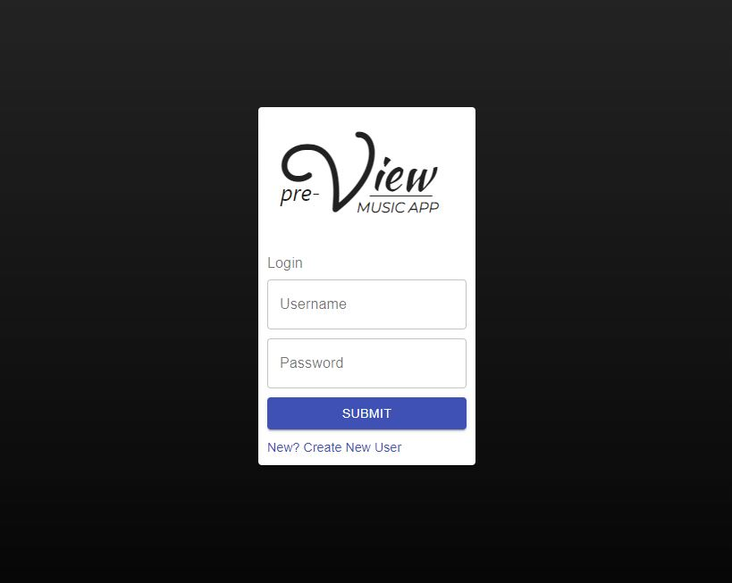

# preView Music App

      

## Project Description
preView is a music playlist app that uses the Deezer API to allow users to create their own playlists. These playlists are fully customizable and multiple playlists can be created for a given user.  Using the preView app, a user can search for any song on the Deezer API and listen to a short segment of the song.  These searched songs can also be added to user playlists and deleted from a playlist should they already exist in it. These playlists can also be deleted, regardless of how many songs are on it.

## Technologies Used:

- Java
- Spring Boot Data
- Spring Boot Web
- JUnit5
- Mockito
- Lobmok
- React
- Redux
- Typescript
- Material UI
- axios
- Deezer API
- CSS

## Features
- Users are able to be created

- Users are able to log in

- Users are able to change their information

- Users are able to create playlists

- Users are able to delete playlists

- Users are able to add songs to playlists

- Users are able to remove songs from playlists

- Users are able to search for songs using the Deezer API

## Images

---

## Getting Started

First, clone the repository into a folder of your choice using
``git clone http://github.com/JMantis0/MusicApp.git``

Running Backend:
Open the backend in an IDE of your choice and run the ``main`` method.

Running Frontend:
Navigate to the folder containing ``/client``, then run 
``npm i`` to install react. Once installed, run ``npm start`` to start the front end

## Contributors
Jesse Mazur
Stephen Barnard
Jeremy Cowelchuk

## License

Copyright (c) 2020 Jesse Mazur, Stephen Barnard, Jeremy Cowelchuk

Permission is hereby granted, free of charge, to any person obtaining a copy
of this software and associated documentation files (the "Software"), to deal
in the Software without restriction, including without limitation the rights
to use, copy, modify, merge, publish, distribute, sublicense, and/or sell
copies of the Software, and to permit persons to whom the Software is
furnished to do so, subject to the following conditions:

The above copyright notice and this permission notice shall be included in all
copies or substantial portions of the Software.

THE SOFTWARE IS PROVIDED "AS IS", WITHOUT WARRANTY OF ANY KIND, EXPRESS OR
IMPLIED, INCLUDING BUT NOT LIMITED TO THE WARRANTIES OF MERCHANTABILITY,
FITNESS FOR A PARTICULAR PURPOSE AND NONINFRINGEMENT. IN NO EVENT SHALL THE
AUTHORS OR COPYRIGHT HOLDERS BE LIABLE FOR ANY CLAIM, DAMAGES OR OTHER
LIABILITY, WHETHER IN AN ACTION OF CONTRACT, TORT OR OTHERWISE, ARISING FROM,
OUT OF OR IN CONNECTION WITH THE SOFTWARE OR THE USE OR OTHER DEALINGS IN THE
SOFTWARE.
